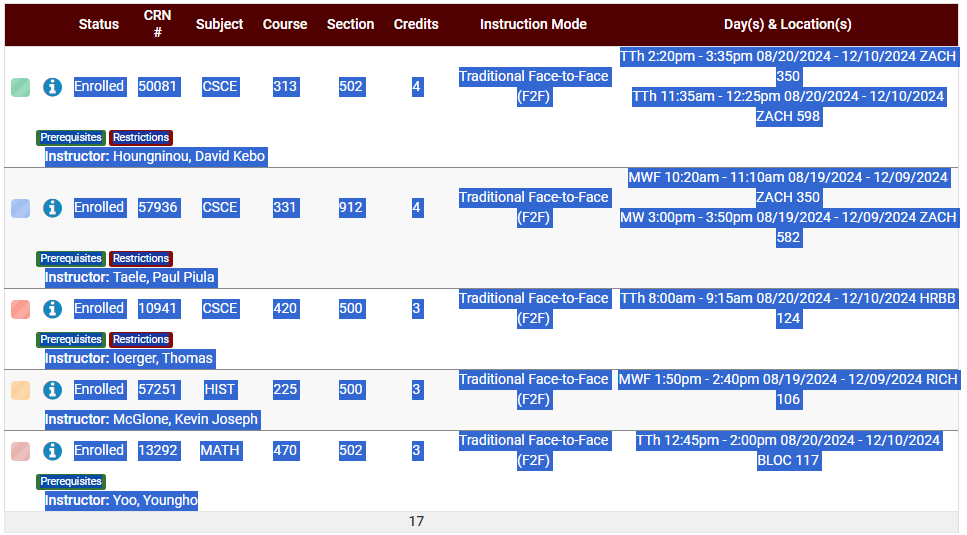

# Find-Final-Times

Super easy program to view your final times for different schedules. Works for A&M students for the Fall '24 semester. I have a seperate program to generate the dictionary, I didn't do that my hand lol. Hopefully it should work well, but let me know if you find any bugs please!

## Installation

- Clone repo to local machine
```bash
git clone https://github.com/DavidHigpen/Find-Final-Times.git
```

- Or just copy and paste the one script into your IDE of choice


## Usage

1. Hit run

2. In Aggie Schedule builder just highlight all the important info and paste it directly into the terminal

Example useage:



